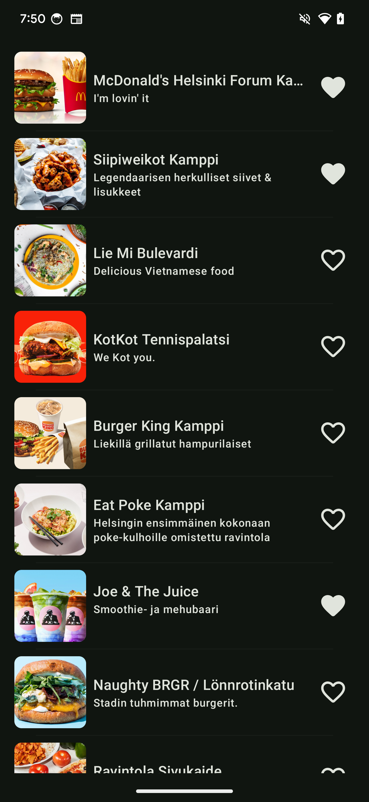
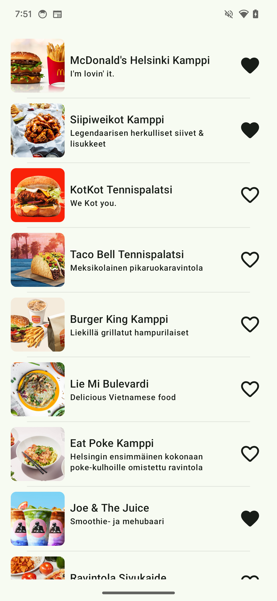

# Wolt Assignment  

This repository houses **Wolt Assignment** Android application, serving as a technical assessment project.

## User Stories

1. **View Restaurants List**: A user is walking around Helsinki city centre looking for a place to eat.
2. **Favourite Restaurants**: Each venue also has “Favorite” action next to it. “Favorite” works as a toggle (true/false) and changes the icon depending on the state. Your app should remember these states and reapply them to venues that come from the server again.

## Functionality

The app consists of a main compose screen, designed to provide a seamless user experience for exploring the restaurants as location changes.

| Dark UI                                 | Light UI                                  |
|-----------------------------------------|-------------------------------------------|
|  |  |

## Technical details

The **Wolt Assessment** Android application is built with a strong emphasis on software engineering best practices, ensuring a robust, maintainable, and scalable codebase.

### Architecture & Design Patterns

* **Clean Architecture**: The project adheres to the principles of Clean Architecture, promoting _separation of concerns_ and _testability_. The code is organized into distinct layers (_Data_, _Domain_, and _Presentation_) with well-defined responsibilities.
* **SOLID Principles**: The application follows _SOLID_ principles (Single Responsibility, Open/Closed, Liskov Substitution, Interface Segregation, Dependency Inversion), leading to a more flexible and adaptable codebase.
* **MVVM Pattern**: The Model-View-ViewModel (_MVVM_) pattern is employed to structure the presentation layer, providing a clear separation between UI logic and business logic.

### Data Layer

* **Remote API Service**: The app utilizes _Retrofit_ and _OkHttp_ to interact with Wold backend, enabling efficient retrieval of remote data.
* **Local Database**: _Room_ database library is used to cache and store favourited restaurants data locally, allowing persisting the data between app run and getting the remote data.

### Domain Layer

* **Repositories**: The Domain layer defines repositories (`LocationRepository`,  `RestaurantsRepository`)  as interfaces, providing an abstraction layer for accessing data from various sources (location provider, network, or database), implemented in the data layer.
* **Kotlin Coroutines**: _Kotlin Coroutines_ are leveraged to handle asynchronous operations (network calls, database IO interactions) in a concise and efficient manner, primarily using the IO dispatcher for background tasks.

### Presentation Layer (View)

* **Jetpack Compose**: The user interface is built entirely with Jetpack Compose, Google's modern declarative UI toolkit, offering a more intuitive and flexible way to create dynamic and engaging user experiences.

### Dependency Injection (DI)

* **Koin**: _Koin_ is the chosen dependency injection framework, simplifying the management of object dependencies and promoting code testability.

### Testing & Quality Assurance

* **Unit Tests**: The codebase is covered by some unit tests due to time limitations, written using the _MockK_ mocking library, ensuring the correctness of individual components.
* **Code Style and Static Analysis**: _Ktlint_ and _Detekt_ are utilized to enforce consistent code style and identify potential code smells, further enhancing the maintainability and quality of the codebase.
* **Continuous Integration (CI)**: _GitHub Actions_ is used to automate the build, test, and code coverage reporting processes, ensuring code quality and early detection of potential issues.
